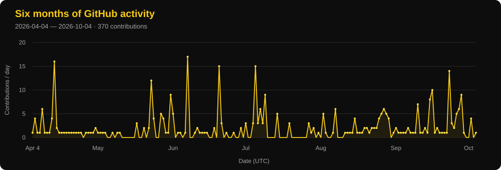

<!--

  

-->

# Hi, I’m Sekharendu Dey 👋

 I'm a software engineer working primarily with TypeScript, Node.js, and React, building backend services, APIs, and web applications.

 More recently, I've been putting a lot of my time into LLM integrations, from context management and tool calling to retries, fallback routing, and evaluation.

 I've built and worked on production systems, plus building and maintaining open-source projects has been part of the journey too.

  
  &nbsp;
  
  &nbsp;
  
  &nbsp;
  

## Selected work

<table>
  <tr>
    <td width="50%" valign="top">
      <h3><a href="https://github.com/Sekharendu/LocalCortex">LocalCortex</a></h3>
      
A local RAG application for chatting with PDF, Word, and Markdown documents.

      
Improved retrieval MRR from <strong>0.912 to 0.952</strong> using a 113-question evaluation harness.

      
<a href="https://sekharendu.github.io/LocalCortex/">Project page →</a>

    </td>
    <td width="50%" valign="top">
      <h3><a href="https://github.com/Sekharendu/Agnost-AI-Adapter">Agnost AI Adapter</a></h3>
      
An npm package that adds telemetry to AI SDK calls while preserving their existing interfaces.

      
Includes <strong>48 automated tests</strong> covering installation, streaming, failures, and Proxy behaviour.

      
<a href="https://www.npmjs.com/package/agnost-ai-adapter">View on npm →</a>

    </td>
  </tr>
</table>

## Currently building

- **[StreamMind](https://github.com/Sekharendu/StreamMind)**: a backend bringing together streaming, retrieval, conversation history, observability, and multi-provider LLM fallback.

## Toolbox

             

## Writing

- **[Chunking: Getting the First Cut Right](https://www.sekharendudey.com/#blogs)**: choosing a chunking strategy for RAG.
- **[Measuring Before Painting: Why My Dropdown Needed useLayoutEffect](https://www.sekharendudey.com/#blogs)**: fixing viewport-aware menu positioning in a custom editor.

I share engineering notes and project progress on [X](https://x.com/Sekharendu60107) and [dev.to](https://dev.to/sekharendu_dey/).

## GitHub activity

  I’m open to remote backend and AI engineering opportunities.

  <a href="mailto:sekharendudey12@gmail.com">Email me</a>
  &nbsp;·&nbsp;
  <a href="https://cal.com/sekharendu-dey">Book a call</a>

